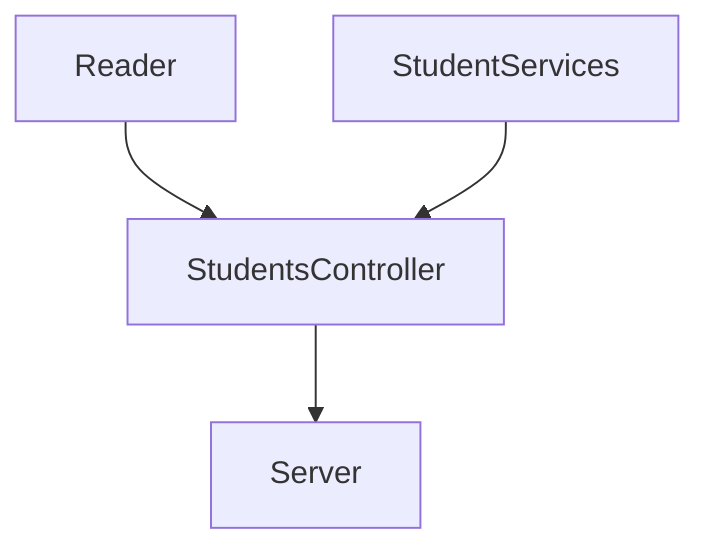

# Code Challenge - Visual Thinking API Courses

This exercise was proposed by CarloGilmar on behalf of LaunchX.

## Some dependencies are used in this project such as: 
| Dependency | Command |
|---|---|
| [Express](https://www.npmjs.com/package/express) | `npm i --save express` |
| [EsLint](https://jestjs.io/) | `npm i eslint --save-dev` |
| [Jest](https://eslint.org/) | `npm i jest@26.0.0 --save-dev` |

If you want to download the project don't forget to run **`npm i`** to install the necessary dependencies.

## There are some scripts in the package.json to speed up some commands:
```javascript
"scripts": {
    "test": "node ./node_modules/jest/bin/jest.js",
    "linter": "node ./node_modules/eslint/bin/eslint.js .",
    "linter-fix": "node ./node_modules/eslint/bin/eslint.js . --fix",
    "server": "node ./lib/server.js"
},
```

- `npm run test` = To run the tests
- `npm run linter` = To examine the code according to the rules imposed in the .eslintrc.js file
- `npm run linter-fix` = To resolve errors according to the rules
- `npm run server` = To stand up the server

## The logic of this project can be seen in this way.



## These are the available **endpoints**.
| Endpoint | Description |
|---|---|
| `http://localhost:3000/v1/students` | Return a list with all students with all their data |
| `http://localhost:3000/v1/students/emails` | Return a list with emails of the students who have the certification  |
| `http://localhost:3000/v1/students/credits/:credits` | Returns a list of students whose credits are greater than the parameter |
